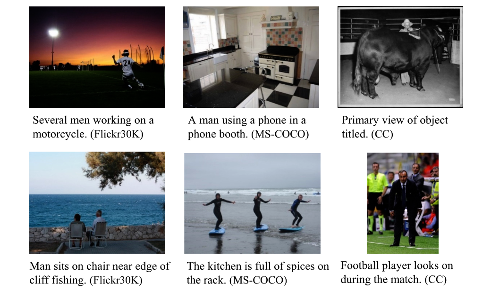
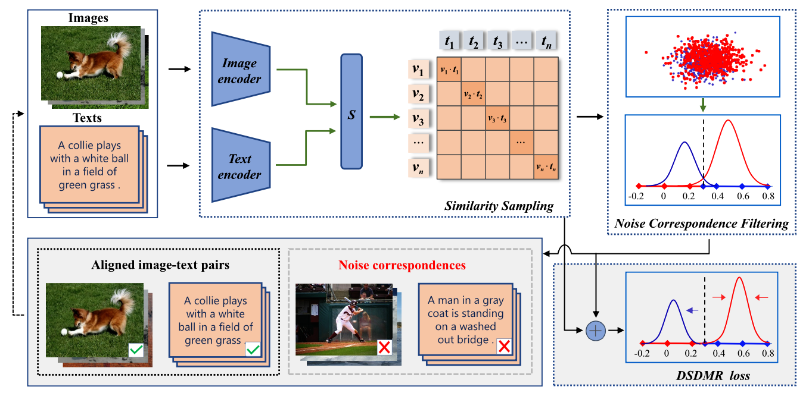
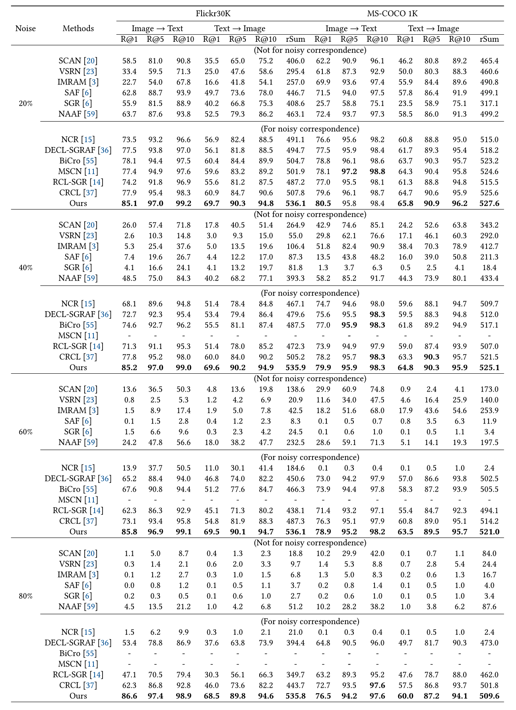
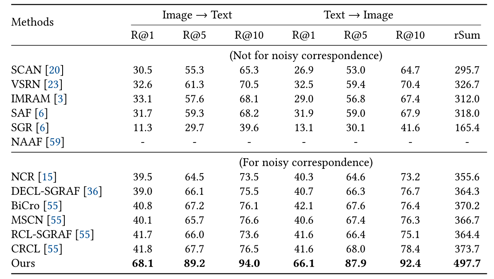
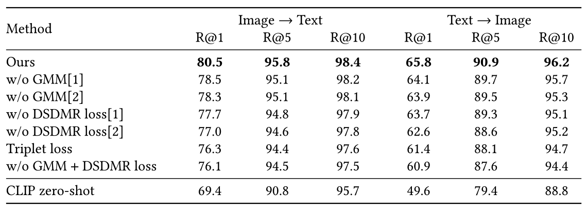
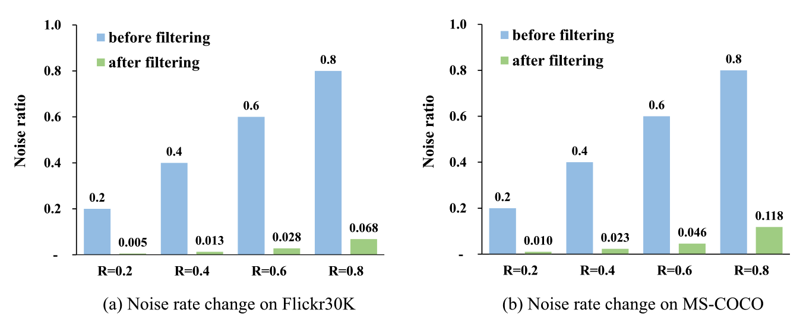
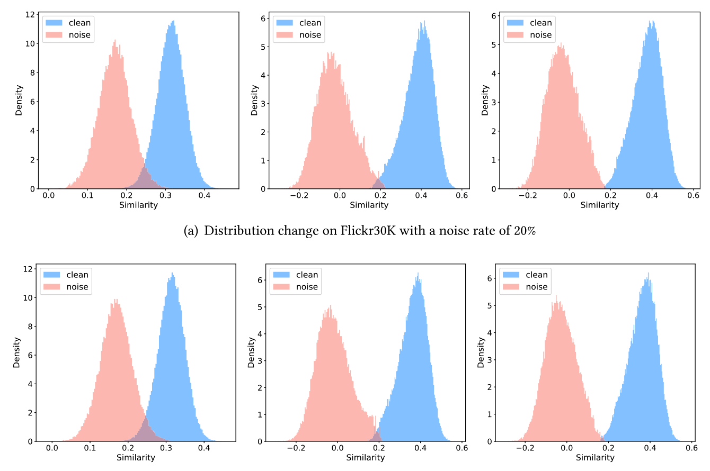

# [TOIS 24] Breaking Through the Noisy Correspondence: A Robust Model for Image-Text Matching

> DSDMR is a robust cross-modal retrieval framework that effectively handles noisy image-text correspondence through similarity distribution modeling and calibrated similarity learning, achieving state-of-the-art performance on major benchmarks.

## Authors

**Haitao Shi**<sup>1</sup>, **Meng Liu**<sup>2</sup>\*, **Xiaoxuan Mu**<sup>1</sup>, **Xuemeng Song**<sup>1</sup>, **Yupeng Hu**<sup>1</sup>, **Liqiang Nie**<sup>3</sup>\*

<sup>1</sup> School of Software, Shandong University, Jinan, China  
<sup>2</sup> School of Computer Science and Technology, Shandong Jianzhu University, Jinan, China  
<sup>3</sup> School of Computer Science and Technology, Harbin Institute of Technology (Shenzhen), Shenzhen, China  
\* Corresponding authors

## Links

- **Paper**: [ACM DL Link](https://dl.acm.org/doi/10.1145/3662732)
- **Code Repository**: [GitHub](https://github.com/shinian-023/DSDMR)

---

## Table of Contents

- [Updates](#updates)
- [Introduction](#introduction)
- [Highlights](#highlights)
- [Method / Framework](#method--framework)
- [Project Structure](#project-structure)
- [Experimental Results](#experimental-results)
- [Installation](#installation)
- [Usage](#usage)
- [Citation](#citation)
- [Acknowledgement](#acknowledgement)
- [License](#license)

---

## Updates

- [04/2026] Initial release of code and documentation.

---

## Introduction

This project is the official implementation of the paper **Breaking Through the Noisy Correspondence: A Robust Model for Image-Text Matching**, published in **ACM TOIS**.

### Problem Addressed

**Figure 1.** Examples of noisy correspondence from Flickr30K, MS-COCO, and Conceptual Captions (CCs) datasets. The artificial noisy correspondence was injected into the Flickr30K and MS-COCO datasets, whereas the noisy correspondence in the CC dataset is authentic.

Traditional image-text matching models are highly sensitive to **Noisy Correspondence** (misaligned image-text pairs). DSDMR addresses the performance degradation and gradient misguidance caused by these noisy samples in large-scale datasets.

### Core Idea
DSDMR enhances noise robustness through **Similarity Distribution Modeling**. It transforms noise filtering into a parameter estimation problem using a bimodal Gaussian Mixture Model (GMM) to explicitly separate "clean" and "noisy" distributions. 

### Key Characteristics
- **Separation Mechanism**: Effectively distinguishes reliable pairs from noisy ones.
- **Dynamic Optimization**: Features a specialized loss function that adjusts margins to enhance distribution separability.
- **Plug-and-Play Framework**: As a post-processing module, it can be seamlessly integrated into any pretrained cross-modal model (e.g., CLIP) without modifying the original architecture.

---

## Highlights

- **Similarity Distribution Modeling**: Transforms noise filtering into a parameter estimation problem of a bimodal GMM.
- **DSDMR Loss Function**: Dynamically adjusts margins to enhance the separability of distributions and mitigate gradient misguidance.
- **Plug-and-Play**: Seamlessly integrated into any pretrained cross-modal model (e.g., CLIP).
- **State-of-the-Art**: Demonstrates superior robustness under various noise rates across three major benchmarks.

---

## Method / Framework


**Figure 2.** Schematic representation of our proposed methodology. (1) Similarity Sampling: Leveraging the CLIP model, image-text similarity samples are obtained from pairs exhibiting noisy correspondence. (2) Noisy Correspondence Filtering: A bimodal GMM segregates similarity samples into  clean” and ”noisy” distributions, facilitating the filtering out of noisy correspondence. (3) DSDMR Loss: By discerning the data distribution, the DSDMR loss dynamically modulates the margin, further mitigating the detrimental influence of noisy correspondence.

---
## Experimental Results


**Table 3.** Performance Comparison Between the Proposed Method and the State-of-the-Art Baselines at Different Noise Rates on Flickr30K and MS-COCO 1K.


**Table 4.** Performance Comparison Between Our Proposed Method and the State-of-the-Art Baselines on CC152K.


**Table 5.** Ablation Studies of Our Model on the MS-COCO Dataset with 20% Noise.


**Figure 3.** Comparison between initial and post-filtered noise rates across various noise rate settings for the Flickr30K and MS-COCO datasets. Blue indicates the initial noise rate, while green signifies the noise rate after the filtering process.


**Figure 4.** Illustration of similarity distributions before and after noise filtering on the Flickr30K dataset at noise rates of 20% and 40%. The left represents the distribution before filtering, the middle represents the distribution after filtering with a fixed margin loss, and the right represents the distribution after filtering with DSDMR loss. The red delineates the noisy distribution, while the blue depicts the clean distribution.

---


## Project Structure

```text
.
├── CLIPFinetune/          # Scripts and modules for CLIP fine-tuning
├── NCR/                   # Implementation of Noisy Correspondence Robustness modules
├── assets/                # Framework diagrams and visualization results
├── cc152k/                # Dataset-specific processing or configuration for CC152K
├── changedCLIPmodal/      # Modified CLIP model architectures
├── test CLIP/             # Testing and evaluation scripts for CLIP-based models
├── LICENSE
├── README.md
└── __init__.py
```

---

## Installation

### 1. Clone the repository

```bash
git clone [https://github.com/shinian-023/DSDMR.git](https://github.com/shinian-023/DSDMR.git)
cd DSDMR
```

### 2. Create environment

```bash
conda create -n dsdmr python=3.8 -y
conda activate dsdmr
```

### 3. Install dependencies

```bash
pip install -r requirements.txt
```

---

## Usage

### Training

```bash
# Example training command
python CLIPFinetune/train.py
```

### Evaluation

```bash
# Example evaluation command
python test\ CLIP/eval.py
```

---

## Citation

```bibtex
@article{DSDMR_TOIS2024,
  author    = {Haitao Shi and
               Meng Liu and
               Xiaoxuan Mu and
               Xuemeng Song and
               Yupeng Hu and
               Liqiang Nie},
  title     = {Breaking Through the Noisy Correspondence: {A} Robust Model for Image-Text Matching},
  journal   = {{ACM} Trans. Inf. Syst.},
  volume    = {42},
  number    = {6},
  pages     = {149:1--149:26},
  year      = {2024}
}
```

---

## Acknowledgement

- Thanks to our supervisors and collaborators for their valuable support.
- Thanks to the open-source community for providing useful baselines and cross-modal tools.

---

## License

This project is released under the Apache License 2.0.
